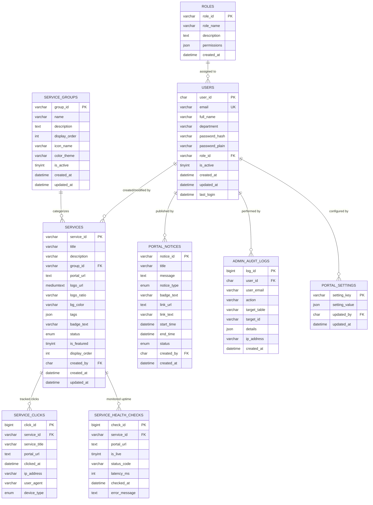

# University of Chittagong — Central Services Portal (`services.cu.ac.bd`)
## MySQL 8.0+ Database Architecture, DDL Specifications & Schema Design Document

**Document Version:** 3.0.0 (MySQL Production Edition)  
**Database Engine:** MySQL 8.0+ (InnoDB Storage Engine, `utf8mb4_unicode_ci`)  
**Target Environment:** University of Chittagong ICT Cell & Cloud Production  
**Primary Port:** `3306`  
**Client Driver:** `mysql2`  
**Author:** ICT Cell, University of Chittagong (`tonmoy.ict@cu.ac.bd`)

---

## 1. Architectural Overview & Design Principles

The University of Chittagong Central Services Portal (`services.cu.ac.bd`) functions as the centralized digital gateway for all student, faculty, administrative, and research applications. This schema incorporates high-availability requirements, audit logging, real-time service health tracking, click analytics infographics, and dynamic settings:

1. **MySQL 8.0+ Standard Implementation:** Designed with native MySQL 8.0+ features: `JSON` column types for role permissions and tags, microsecond timestamp precision (`DATETIME(3)`), `AUTO_INCREMENT` keys for high-velocity logging, and strict `InnoDB` foreign key constraints (`ON UPDATE CASCADE ON DELETE RESTRICT`).
2. **Service Clicks & Infographics Engine (`service_clicks`):** Records every click on portal links with high-precision timestamp (`DATETIME(3)`), target service ID, device type (`desktop`, `mobile`, `tablet`), and IP address for infographic generation (daily trends, hourly peak curves, and service popularity leaderboards).
3. **Live Health & Pinging Engine (`service_health_checks`):** Records periodic reachability checks, HTTP status codes (`200 OK`, `503`, `TIMEOUT`), and latency in milliseconds. Allows the portal to display a real-time green border/active status indicator or maintenance alert.
4. **Card Background & Logo Customization (`bg_color`):** Provides explicit `#hex` or custom color persistence for service cards, ensuring consistent visual identity across portals.
5. **Dynamic Portal & Typography Settings (`portal_settings`):** Stores dynamically selected English and Bangla typography presets configured via the Admin UI without modifying code files.
6. **Backward & Cross-Compatibility View (`services_group`):** A MySQL view pointing to `service_groups` ensures legacy scripts querying singular `services_group` or plural `service_groups` both execute without errors.
7. **Scoped Role-Based Access Control (RBAC):** Restricts administrative personnel to specific maintenance domains (`SUPER_ADMIN`, `MAINTENANCE_SERVICES`, `MAINTENANCE_NOTICES`, `MAINTENANCE_GROUPS`, `MAINTENANCE_VIEWER`).

---

## 2. Entity-Relationship Diagram (ERD)



---

## 3. MySQL 8.0+ Complete DDL Specifications

```sql
-- ============================================================================
-- UNIVERSITY OF CHITTAGONG CENTRAL SERVICES PORTAL (services.cu.ac.bd)
-- MYSQL 8.0+ DDL SCHEMA DEFINITIONS
-- ============================================================================

CREATE DATABASE IF NOT EXISTS \`cu_services_portal\`
  CHARACTER SET utf8mb4
  COLLATE utf8mb4_unicode_ci;

USE \`cu_services_portal\`;

-- ----------------------------------------------------------------------------
-- 1. TABLE: roles
-- ----------------------------------------------------------------------------
CREATE TABLE IF NOT EXISTS \`roles\` (
  \`role_id\` VARCHAR(32) NOT NULL,
  \`role_name\` VARCHAR(64) NOT NULL,
  \`description\` TEXT NULL,
  \`permissions\` JSON NOT NULL,
  \`created_at\` DATETIME(3) NOT NULL DEFAULT CURRENT_TIMESTAMP(3),
  PRIMARY KEY (\`role_id\`)
) ENGINE=InnoDB DEFAULT CHARSET=utf8mb4 COLLATE=utf8mb4_unicode_ci;

-- ----------------------------------------------------------------------------
-- 2. TABLE: users
-- ----------------------------------------------------------------------------
CREATE TABLE IF NOT EXISTS \`users\` (
  \`user_id\` CHAR(36) NOT NULL,
  \`email\` VARCHAR(128) NOT NULL,
  \`full_name\` VARCHAR(100) NOT NULL,
  \`department\` VARCHAR(100) NOT NULL,
  \`password_hash\` VARCHAR(255) NOT NULL,
  \`password_plain\` VARCHAR(255) NOT NULL,
  \`role_id\` VARCHAR(32) NOT NULL,
  \`is_active\` TINYINT(1) NOT NULL DEFAULT 1,
  \`created_at\` DATETIME(3) NOT NULL DEFAULT CURRENT_TIMESTAMP(3),
  \`updated_at\` DATETIME(3) NOT NULL DEFAULT CURRENT_TIMESTAMP(3) ON UPDATE CURRENT_TIMESTAMP(3),
  \`last_login\` DATETIME(3) NULL,
  PRIMARY KEY (\`user_id\`),
  UNIQUE KEY \`uk_users_email\` (\`email\`),
  KEY \`idx_users_role\` (\`role_id\`),
  CONSTRAINT \`fk_users_role\` FOREIGN KEY (\`role_id\`) REFERENCES \`roles\` (\`role_id\`) 
    ON UPDATE CASCADE ON DELETE RESTRICT
) ENGINE=InnoDB DEFAULT CHARSET=utf8mb4 COLLATE=utf8mb4_unicode_ci;

-- ----------------------------------------------------------------------------
-- 3. TABLE: service_groups
-- ----------------------------------------------------------------------------
CREATE TABLE IF NOT EXISTS \`service_groups\` (
  \`group_id\` VARCHAR(64) NOT NULL,
  \`name\` VARCHAR(100) NOT NULL,
  \`description\` TEXT NULL,
  \`display_order\` INT NOT NULL DEFAULT 0,
  \`icon_name\` VARCHAR(64) DEFAULT 'GraduationCap',
  \`color_theme\` VARCHAR(32) DEFAULT 'emerald',
  \`is_active\` TINYINT(1) NOT NULL DEFAULT 1,
  \`created_at\` DATETIME(3) NOT NULL DEFAULT CURRENT_TIMESTAMP(3),
  \`updated_at\` DATETIME(3) NOT NULL DEFAULT CURRENT_TIMESTAMP(3) ON UPDATE CURRENT_TIMESTAMP(3),
  PRIMARY KEY (\`group_id\`),
  KEY \`idx_groups_order\` (\`display_order\`),
  KEY \`idx_groups_active\` (\`is_active\`)
) ENGINE=InnoDB DEFAULT CHARSET=utf8mb4 COLLATE=utf8mb4_unicode_ci;

-- ----------------------------------------------------------------------------
-- 4. VIEW: services_group (Compatibility Alias)
-- ----------------------------------------------------------------------------
CREATE OR REPLACE VIEW \`services_group\` AS 
SELECT 
  \`group_id\`, 
  \`name\`, 
  \`description\`, 
  \`display_order\`, 
  \`icon_name\`, 
  \`color_theme\`, 
  \`is_active\`, 
  \`created_at\`, 
  \`updated_at\` 
FROM \`service_groups\`;

-- ----------------------------------------------------------------------------
-- 5. TABLE: services
-- ----------------------------------------------------------------------------
CREATE TABLE IF NOT EXISTS \`services\` (
  \`service_id\` VARCHAR(64) NOT NULL,
  \`title\` VARCHAR(128) NOT NULL,
  \`description\` VARCHAR(400) NOT NULL,
  \`group_id\` VARCHAR(64) NOT NULL,
  \`portal_url\` TEXT NULL,
  \`logo_url\` MEDIUMTEXT NOT NULL,
  \`logo_ratio\` VARCHAR(10) NOT NULL DEFAULT '16:9',
  \`bg_color\` VARCHAR(32) NULL DEFAULT '#0f172a',
  \`tags\` JSON NULL,
  \`badge_text\` VARCHAR(32) NULL,
  \`status\` ENUM('ACTIVE', 'DISABLED', 'COMING_SOON') NOT NULL DEFAULT 'ACTIVE',
  \`is_featured\` TINYINT(1) NOT NULL DEFAULT 0,
  \`display_order\` INT NOT NULL DEFAULT 0,
  \`created_by\` CHAR(36) NULL,
  \`created_at\` DATETIME(3) NOT NULL DEFAULT CURRENT_TIMESTAMP(3),
  \`updated_at\` DATETIME(3) NOT NULL DEFAULT CURRENT_TIMESTAMP(3) ON UPDATE CURRENT_TIMESTAMP(3),
  PRIMARY KEY (\`service_id\`),
  KEY \`idx_services_group\` (\`group_id\`),
  KEY \`idx_services_status\` (\`status\`),
  KEY \`idx_services_order\` (\`display_order\`),
  CONSTRAINT \`fk_services_group\` FOREIGN KEY (\`group_id\`) REFERENCES \`service_groups\` (\`group_id\`) 
    ON UPDATE CASCADE ON DELETE RESTRICT,
  CONSTRAINT \`fk_services_user\` FOREIGN KEY (\`created_by\`) REFERENCES \`users\` (\`user_id\`) 
    ON DELETE SET NULL
) ENGINE=InnoDB DEFAULT CHARSET=utf8mb4 COLLATE=utf8mb4_unicode_ci;

-- ----------------------------------------------------------------------------
-- 6. TABLE: portal_notices
-- ----------------------------------------------------------------------------
CREATE TABLE IF NOT EXISTS \`portal_notices\` (
  \`notice_id\` VARCHAR(64) NOT NULL,
  \`title\` VARCHAR(160) NOT NULL,
  \`message\` TEXT NOT NULL,
  \`notice_type\` ENUM('info', 'warning', 'alert', 'coming_soon', 'maintenance') NOT NULL DEFAULT 'info',
  \`badge_text\` VARCHAR(32) NULL,
  \`link_url\` TEXT NULL,
  \`link_text\` VARCHAR(64) NULL,
  \`start_time\` DATETIME(3) NOT NULL,
  \`end_time\` DATETIME(3) NOT NULL,
  \`status\` ENUM('ACTIVE', 'DISABLED') NOT NULL DEFAULT 'ACTIVE',
  \`created_by\` CHAR(36) NULL,
  \`created_at\` DATETIME(3) NOT NULL DEFAULT CURRENT_TIMESTAMP(3),
  PRIMARY KEY (\`notice_id\`),
  KEY \`idx_notices_window\` (\`status\`, \`start_time\`, \`end_time\`),
  CONSTRAINT \`fk_notices_user\` FOREIGN KEY (\`created_by\`) REFERENCES \`users\` (\`user_id\`) 
    ON DELETE SET NULL
) ENGINE=InnoDB DEFAULT CHARSET=utf8mb4 COLLATE=utf8mb4_unicode_ci;

-- ----------------------------------------------------------------------------
-- 7. TABLE: service_clicks (Click Tracking & Infographics)
-- ----------------------------------------------------------------------------
CREATE TABLE IF NOT EXISTS \`service_clicks\` (
  \`click_id\` BIGINT NOT NULL AUTO_INCREMENT,
  \`service_id\` VARCHAR(64) NOT NULL,
  \`service_title\` VARCHAR(128) NOT NULL,
  \`portal_url\` TEXT NOT NULL,
  \`clicked_at\` DATETIME(3) NOT NULL DEFAULT CURRENT_TIMESTAMP(3),
  \`ip_address\` VARCHAR(45) NULL,
  \`user_agent\` VARCHAR(255) NULL,
  \`device_type\` ENUM('desktop', 'mobile', 'tablet') NOT NULL DEFAULT 'desktop',
  PRIMARY KEY (\`click_id\`),
  KEY \`idx_clicks_service_time\` (\`service_id\`, \`clicked_at\`),
  KEY \`idx_clicks_time\` (\`clicked_at\`),
  CONSTRAINT \`fk_clicks_service\` FOREIGN KEY (\`service_id\`) REFERENCES \`services\` (\`service_id\`) 
    ON UPDATE CASCADE ON DELETE CASCADE
) ENGINE=InnoDB DEFAULT CHARSET=utf8mb4 COLLATE=utf8mb4_unicode_ci;

-- ----------------------------------------------------------------------------
-- 8. TABLE: service_health_checks (Live Pinging & 200 OK Uptime Logs)
-- ----------------------------------------------------------------------------
CREATE TABLE IF NOT EXISTS \`service_health_checks\` (
  \`check_id\` BIGINT NOT NULL AUTO_INCREMENT,
  \`service_id\` VARCHAR(64) NOT NULL,
  \`portal_url\` TEXT NOT NULL,
  \`is_live\` TINYINT(1) NOT NULL DEFAULT 1,
  \`status_code\` VARCHAR(32) NOT NULL DEFAULT '200 OK',
  \`latency_ms\` INT NOT NULL DEFAULT 0,
  \`checked_at\` DATETIME(3) NOT NULL DEFAULT CURRENT_TIMESTAMP(3),
  \`error_message\` TEXT NULL,
  PRIMARY KEY (\`check_id\`),
  KEY \`idx_health_service\` (\`service_id\`, \`checked_at\`),
  KEY \`idx_health_live\` (\`is_live\`, \`checked_at\`),
  CONSTRAINT \`fk_health_service\` FOREIGN KEY (\`service_id\`) REFERENCES \`services\` (\`service_id\`) 
    ON UPDATE CASCADE ON DELETE CASCADE
) ENGINE=InnoDB DEFAULT CHARSET=utf8mb4 COLLATE=utf8mb4_unicode_ci;

-- ----------------------------------------------------------------------------
-- 9. TABLE: admin_audit_logs
-- ----------------------------------------------------------------------------
CREATE TABLE IF NOT EXISTS \`admin_audit_logs\` (
  \`log_id\` BIGINT NOT NULL AUTO_INCREMENT,
  \`user_id\` CHAR(36) NULL,
  \`user_email\` VARCHAR(128) NOT NULL,
  \`action\` VARCHAR(64) NOT NULL,
  \`target_table\` VARCHAR(64) NOT NULL,
  \`target_id\` VARCHAR(64) NOT NULL,
  \`details\` JSON NULL,
  \`ip_address\` VARCHAR(45) NULL,
  \`created_at\` DATETIME(3) NOT NULL DEFAULT CURRENT_TIMESTAMP(3),
  PRIMARY KEY (\`log_id\`),
  KEY \`idx_audit_user\` (\`user_id\`),
  KEY \`idx_audit_action\` (\`action\`, \`created_at\`),
  CONSTRAINT \`fk_audit_user\` FOREIGN KEY (\`user_id\`) REFERENCES \`users\` (\`user_id\`) 
    ON DELETE SET NULL
) ENGINE=InnoDB DEFAULT CHARSET=utf8mb4 COLLATE=utf8mb4_unicode_ci;

-- ----------------------------------------------------------------------------
-- 10. TABLE: portal_settings (Dynamic Fonts & App Parameters)
-- ----------------------------------------------------------------------------
CREATE TABLE IF NOT EXISTS \`portal_settings\` (
  \`setting_key\` VARCHAR(64) NOT NULL,
  \`setting_value\` JSON NOT NULL,
  \`updated_by\` CHAR(36) NULL,
  \`updated_at\` DATETIME(3) NOT NULL DEFAULT CURRENT_TIMESTAMP(3) ON UPDATE CURRENT_TIMESTAMP(3),
  PRIMARY KEY (\`setting_key\`),
  CONSTRAINT \`fk_settings_user\` FOREIGN KEY (\`updated_by\`) REFERENCES \`users\` (\`user_id\`) 
    ON DELETE SET NULL
) ENGINE=InnoDB DEFAULT CHARSET=utf8mb4 COLLATE=utf8mb4_unicode_ci;
```

---

## 4. Useful MySQL Queries for Analytics & Maintenance

### 4.1 Clicks Infographics Query: Top 10 Services by Click Volume (Last 30 Days)
```sql
SELECT 
    s.service_id,
    s.title,
    s.portal_url,
    COUNT(c.click_id) AS total_clicks,
    ROUND((COUNT(c.click_id) * 100.0 / (SELECT COUNT(*) FROM service_clicks WHERE clicked_at >= NOW() - INTERVAL 30 DAY)), 1) AS percentage_share,
    MAX(c.clicked_at) AS last_clicked
FROM services s
LEFT JOIN service_clicks c ON s.service_id = c.service_id AND c.clicked_at >= NOW() - INTERVAL 30 DAY
GROUP BY s.service_id, s.title, s.portal_url
ORDER BY total_clicks DESC
LIMIT 10;
```

### 4.2 Hourly Traffic Peak Distribution Query (24-Hour Infographic)
```sql
SELECT 
    HOUR(clicked_at) AS hour_of_day,
    COUNT(click_id) AS click_count,
    SUM(CASE WHEN device_type = 'mobile' THEN 1 ELSE 0 END) AS mobile_clicks,
    SUM(CASE WHEN device_type = 'desktop' THEN 1 ELSE 0 END) AS desktop_clicks
FROM service_clicks
WHERE clicked_at >= NOW() - INTERVAL 14 DAY
GROUP BY HOUR(clicked_at)
ORDER BY hour_of_day ASC;
```

### 4.3 Latest Health Check Uptime Summary (200 OK vs Down)
```sql
SELECT 
    s.service_id,
    s.title,
    s.portal_url,
    h.is_live,
    h.status_code,
    h.latency_ms,
    h.checked_at
FROM services s
INNER JOIN (
    SELECT service_id, is_live, status_code, latency_ms, checked_at,
           ROW_NUMBER() OVER (PARTITION BY service_id ORDER BY checked_at DESC) as rn
    FROM service_health_checks
) h ON s.service_id = h.service_id AND h.rn = 1
WHERE s.status = 'ACTIVE'
ORDER BY h.is_live ASC, h.latency_ms DESC;
```
